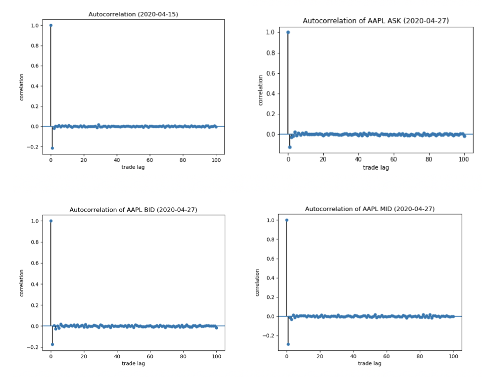

# Intraday Tick Data

## Data
All data in the following analysis was collected from Polygon, a paid stock data provider. National Best Bid Offer (NBBO) and Historical Trade data was used. NBBO data for high frequency trading strategies has been criticised because it has a significant time lag. Exchanges report when they believe they have the best bid/offer based on its order book. As a result, time lag occurs from compilation of the order book, processing the best bid/offer, then sending this information to a server. As a result, NBBO data is not guaranteed to reflect the best price at the time the exchange receives it; however, it is usually a pretty good representation. See Figure 1 for a representation of NBBO data vs historical trades (data is on AAPL stock).

Figure 1: Examples of NBBO bid/ask vs historical reported trades. 

### Data Collection
Historical trade data consists of every reported trade (size, volume, participant timestamp, sip timestamp, and exchange ID). Data was collected for each day by sending multiple url requests to bypass the 50000 trade pull limit per request. The next url request used the final timestamp in the previous request as the start for the next pull. Data was pulled from 9:30 to 16:00 eastern time. After hours trading data is also available; however, this was not analyzed. The largest 10 stocks (CAP wise) were collected: 'NFLX', 'AAPL', 'MSFT', 'FB', 'GOOGL', 'CSCO', 'CMCSA', 'INTC', 'GOOG', 'AMZN'. 

### Data normalization:
In order to normalize the prices of each stock, the baseline price was computed by averaging the first 1000 trades, offset by 100 (we are not including the opening auction or the trades near after in the initial price computation to avoid this high volume and volatility). Each price in the sequence of trades for the given stock was computed by dividing by the baseline and subtracting one. An example of this normalized data is displayed in Figure 2. All dark pool trades were eliminated from the data. 

Figure 2

## Generating a mean line
Generating a mean line proved to be a difficult task because each stock is sampled at a different times, volumes and rates. As a result, a function to create a time based mean of all 10 stocks was created. This algorithm works by selecting the least sampled stock as the template. 3 trades of the templars are iterated linearly. The timestamps of the first and the third trade are used as the start and stop time. For each stock, the volume weighted average price and the total volume is computed in this timeframe. The volume weighted average of these numbers was computed for the 10 stocks. The mean time of the first and second trade was used for the “x” value. An example is shown in Figure 3 of this mean. Strategies involving this mean line were not profitable since the stock’s profitability diverged during early trading.

Figure 3: Moving average of multiple non-uniformly sampled time series. 

## Autocorrelation and Cross Correlation

### Autocorrelation

Autocorrelation was examined at the trade level. AAPL was used to generate the autocorrelation plot. Unfortunately, only one day of trading could be loaded into the computer's ram at a time, so individual days were examined. The first 100 lags are displayed in Figure 4. Notice that the trade at 1 lags is only significantly negatively correlated lag. This is a phenomena called bid ask bounce. One might naively predict that buys will be executed near ask price and sells will be executed near bid price. However, in practice this does not occur. Buyers/sellers often cross the bid/ask spread in order to secure a trade. This causes a phenomenon called bid-ask bounce [4, 5]. Interestingly, NBBO bid/ask/mid price also experienced “bouncing” phenomena, where 1 lags was significantly negatively correlated. We believe this is caused by the bid/ask bounce present in the trade data. The ask will increase whenever there is a sell trade, and the bids will decrease whenever there is a buy trade because the best bid/ask is being partially or fully fulfilled. Since, due to bid-ask bounce, buys and sells tend to alternate, mid-price will increase on sell trades and decrease on buy trades, causing mid-price bounce. Bid and ask prices will also fluctuate in the same way. 

Figure 4: Autocorrelation of historical trades, NBBO bid/ask/mid

### Cross Correlation

Cross correlation was examined and stocks were most correlated at zero lags. See Figure 5 for plot. We see that high cap stocks like apple and netflix show a slightly higher correlation at zero lags, but there are no significant delays. This makes sense because both stocks will respond to market news in a similarly rapid rate. 

Figure 5: Cross correlation plot

## Naive Stock Momentum Strategy
Momentum is common in global stock markets. Momentum investing involves a strategy to capitalize on the continuance of an existing market trend. It involves going long stocks showing upward-trending prices and shorting the respective assets with downward-trending prices.  However, almost all momentum studies are confined to return patterns at the monthly or weekly frequency. We are here to research on whether such return patterns can be observed at the intraday level.
 
APPL was used to test momentum strategies. A sliding window of 10 trade length was used to generate an average signal. See Figure 6 for an example of the average. The avg signal was this discretized to up/down ticks. This means that for an uptick to occur in the average signal, 6 of the trades in the previous 10 trades must be upticks (assuming the other 4 are down ticks). The lengths of consecutive uptick periods (in trades) was examined in Figure 7. Interestingly, there is a “hump” in the histogram at the length of the averaging window, no matter the window size. In order to test momentum strategies, shares were “purchased” after a certain amount of up ticks in a row. This number was varied on the X axis of the two plots of Figure 8. As seen, profit and duration are the highest the fastest and algorithm can purchase. The maximum profit achieved was about 3 cents per trade and an average duration of about 1.7 seconds. Note: this does not take into account trading lag, so in practice trades could not be sold instantly, so profits would decrease. Profits at 1 uptick are still profitable because 1 uptick still suggests that the average of the previous 10 trades was positive. As a result, 1 uptick in the averaged signal is capturing information from the 10 previous trades. These results illustrate why speed is so important to HFT firms. In essence, the faster a firm can react to a signal (like momentum), the more money they make. Profits in the plots do not discount costs of the trade, like crossing the bid offer spread, commission or timing cost. These could make the profits negative. 

Figure 6: Example of moving average

Figure 7: Histogram of length of consecutive up ticks in averaged signal. 

Figure 8: Mean profitability and duration of naive trading strategy

## Using VWAP as a intraday trading signal
VWAP was computed using the previous 5 minutes of trading data at 1 minute increments. An example of the VWAP can be seen in Figure 9. VWAP was used to predict price change by investing whenever VWAP changed direction with significant vigor (this was measured using the “pointiness” of the peak). This strategy yielded an average profit of $ .224 with a standard deviation of $ 1.10 over our 7 day testing period. I believe this algorithm would need to be tested over more days in order to decrease the variance (and possibly the mean).

Figure 9: VWAP of stock using previous 5 minutes with 1 minute updates.

## LSTM Strategy 
Machine learning algorithms offer a black box approach to making predictions. Often machine learning approaches increase accuracy at the price of transparency and intuitivity. Since we are limited by the amount of data and compute power we possess, so overfitting is a risk. This model would need more testing to ensure its rigor. Long Short Term Memory (LSTM) was introduced in 1997 to solve the exploding/vanishing gradient problem by modifying how the gradients flow through the network [7]. LSTMs are a state of the art method for analyzing time series data. After training an LSTM that sees 10 ticks of 1 minute VWAP data that sees 5 minutes into the past, we achieved a 72% accuracy of next tic direction prediction. In other words, this LSTM sees 10 VWAP ticks and predicts the direction of the next VWAP tic. To test this algorithm, a trade was conducted at the end of the last VWAP period the model sees. The algorithm achieved an average profit of 2.4 cents with a standard deviation of 28 cents. This method could be more profitable if it acted on historic trades and predicted a certain amount of time out. This, however, shows LSTMs have the ability to predict VWAP direction and in general stock data. 

## Further Reading
1. Chengevelyn. “Just 10% of Trading Is Regular Stock Picking, JPMorgan Estimates.” CNBC, CNBC, 14 June 2017, www.cnbc.com/2017/06/13/death-of-the-human-investor-just-10-percent-of-trading-is-regular-stock-picking-jpmorgan-estimates.html.
2. Patterson, Scott, and Alexander Osipovich. “High-Frequency Traders Feast on Volatile Market.” The Wall Street Journal, Dow Jones & Company, 27 Mar. 2020, www.wsj.com/articles/high-frequency-traders-feast-on-volatile-market-11585310401?mod=mhp.
3. Fischer, Thomas, and Christopher Krauss. “Deep Learning with Long Short-Term Memory Networks for Financial Market Predictions.” European Journal of Operational Research, vol. 270, no. 2, 2018, pp. 654–669., doi:10.1016/j.ejor.2017.11.054.
4. Lerner, Peter. “Theoretical Analysis of the Bid-Ask Bounce.” Aestimatio, 2010.
5. Harris, Frederick H. Deb., et al. “Security Price Adjustment across Exchanges: an Investigation of Common Factor Components for Dow Stocks.” Journal of Financial Markets, vol. 5, no. 3, 2002, pp. 277–308., doi:10.1016/s1386-4181(01)00017-9.
6. Hochreiter, Sepp, and Jürgen Schmidhuber. “Long Short-Term Memory.” Neural Computation, vol. 9, no. 8, 1997, pp. 1735–1780., doi:10.1162/neco.1997.9.8.1735.

